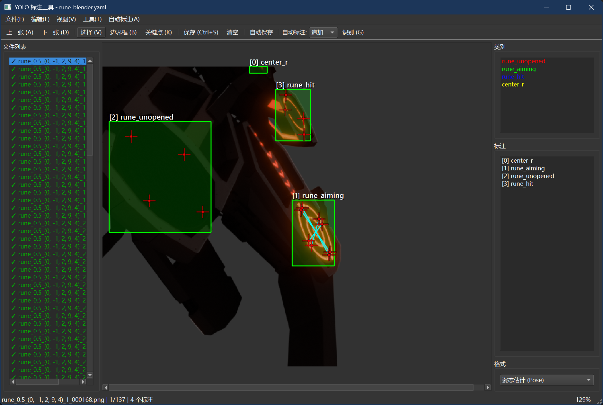
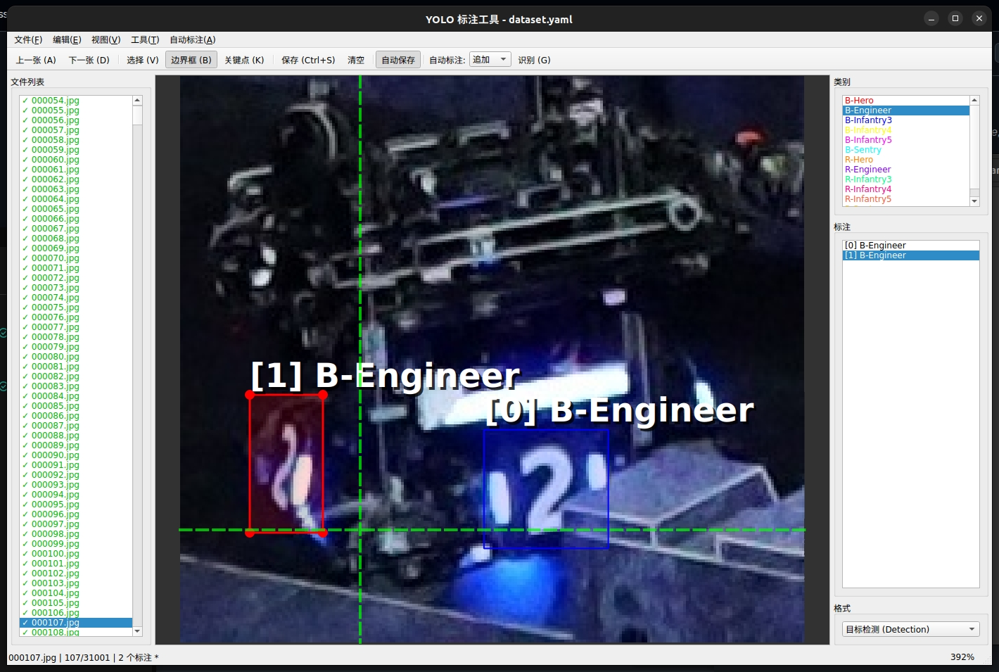
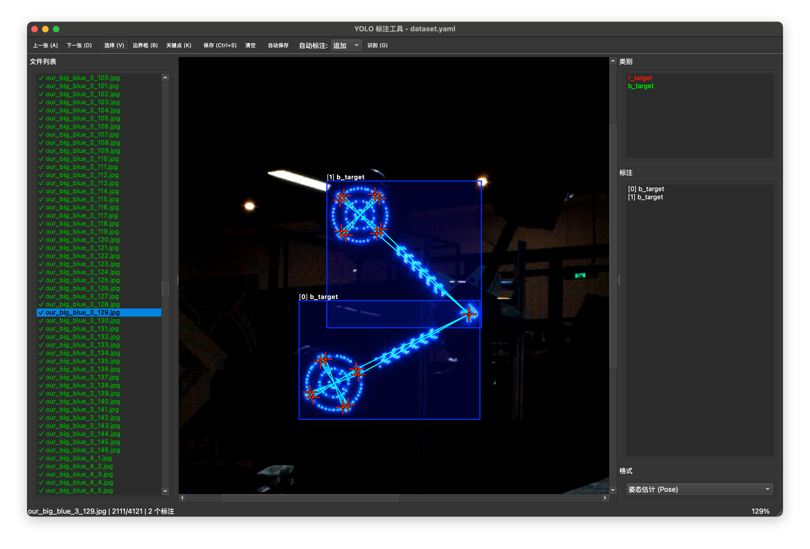
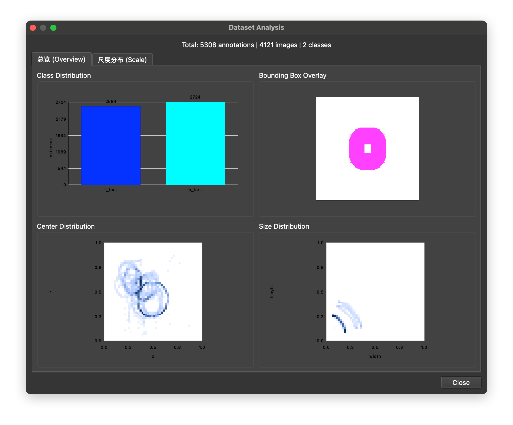
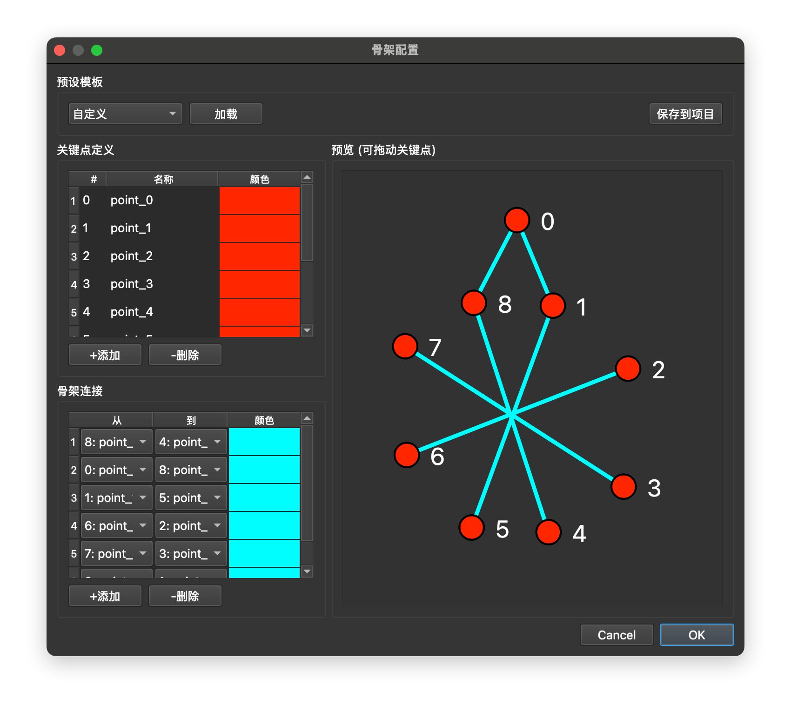
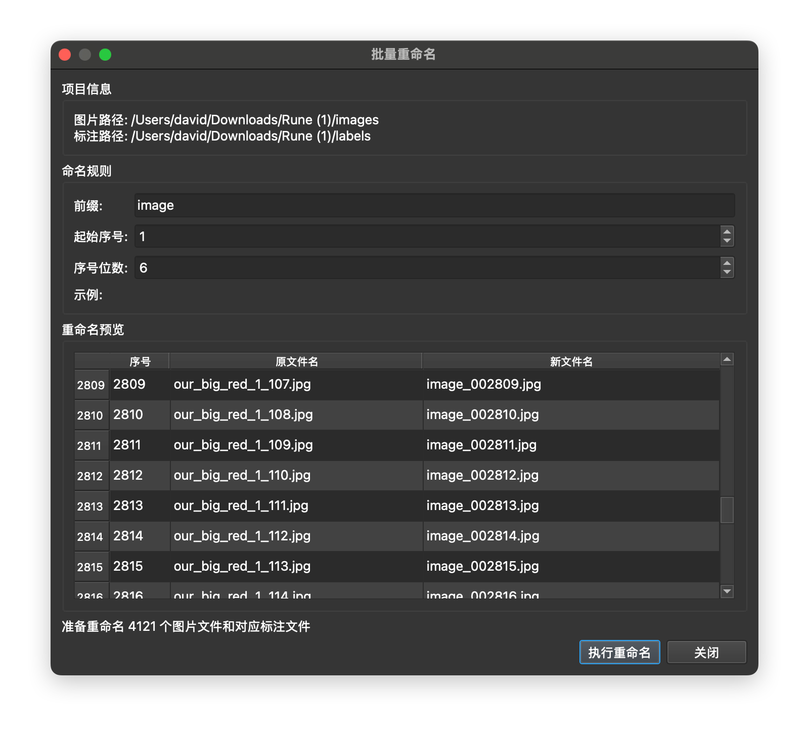
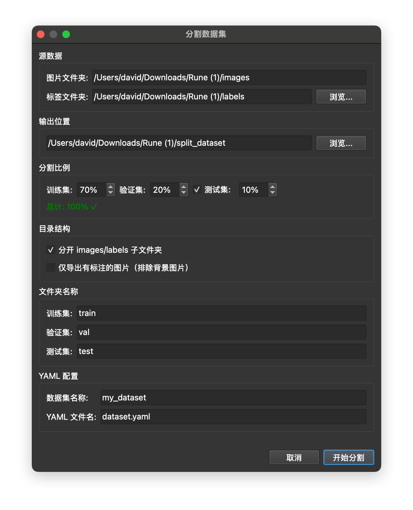
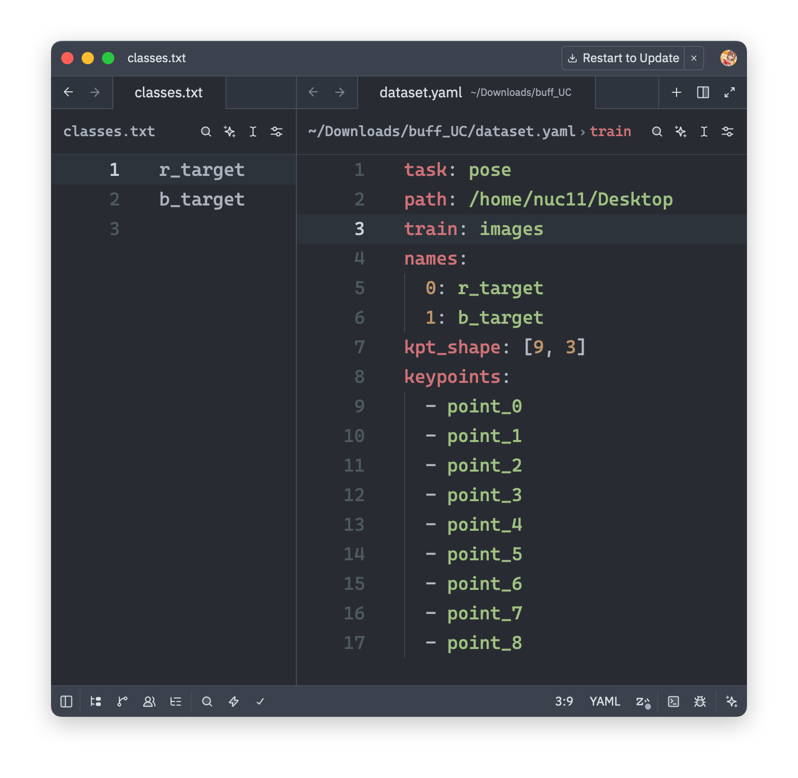

# YoloAnnotator

轻量级 YOLO 数据集标注工具，直接读写 YOLO 格式 txt 文件，开箱即用，改完就存，不需要任何格式转换。

支持目标检测和姿态估计两种标注模式，兼容 Ultralytics YOLO 标准格式。内置 AI 自动标注功能，支持加载 ONNX 模型一键生成标注。








## 特性

- **原生 YOLO 格式** — 直接读写 txt 标注文件，无需导入导出
- **即开即用** — 打开文件夹自动识别 `classes.txt` 或 `dataset.yaml`
- **双模式支持** — 目标检测 (Detection) 和姿态估计 (Pose)
- **AI 自动标注** — 加载 ONNX 模型一键生成标注
- **多后端推理** — CPU / OpenCL / OpenVINO
- **实用工具** — 视频转图片、批量重命名、数据集分割与分析
- **跨平台** — Windows / macOS / Linux

## 下载

在 [Releases](https://github.com/Misaka21/YoloAnnotator/releases) 页面下载对应平台版本：

| 平台                | 文件                                       |
| ------------------- | ------------------------------------------ |
| Windows             | `YoloAnnotator-Windows-x64.zip`          |
| Windows (OpenVINO)  | `YoloAnnotator-Windows-x64-OpenVINO.zip` |
| macOS Intel         | `YoloAnnotator-macOS-Intel.dmg`          |
| macOS Apple Silicon | `YoloAnnotator-macOS-AppleSilicon.dmg`   |
| Linux               | `YoloAnnotator-Linux-x86_64.AppImage`    |

## 使用说明

### 项目设置

支持两种方式打开数据集：

**方式一：`classes.txt`** — 手动指定图片和标签目录。文件格式如下：

```
# classes.txt 示例
ball
cube
tube
```

> 打开时程序会提示分别选择 images 和 labels 文件夹。

**方式二：`dataset.yaml`** — 自动解析目录结构。文件格式如下：



> 如果 yaml 内容正确，程序会自动定位 images 和 labels 目录。

菜单「文件 → 从 classes.txt 创建项目」可新建项目，支持选择任务类型（检测 / 姿态）、关键点数量和格式。

### 基本操作

1. **打开文件夹** — `Ctrl+O` 选择包含图片的文件夹，程序会自动查找 `classes.txt` 或 `dataset.yaml`
2. **切换图片** — `A` 上一张 / `D` 下一张
3. **保存标注** — `Ctrl+S`，也可开启自动保存
4. **绘制边界框** — 选择「绘制框」模式，鼠标拖动绘制
5. **选择/移动** — 选择「选择」模式，点击选中标注，拖动角点调整大小，拖动中心移动位置
6. **添加关键点** — Pose 模式下，选中标注后切换「绘制关键点」模式，依次点击添加
7. **撤销/重做** — `Ctrl+Z` / `Ctrl+Y`

### AI 自动标注

1. **加载模型** — 菜单「自动标注 → 加载模型」，选择 ONNX 文件
2. **标注当前图片** — `Ctrl+G`
3. **批量标注** — 菜单「自动标注 → 批量标注所有」

支持 CPU / OpenCL / OpenVINO 多种推理后端。

### 工具

菜单「工具」栏提供了以下辅助工具：

| 工具           | 说明                                       |
| -------------- | ------------------------------------------ |
| 骨架配置       | 自定义 Pose 关键点骨架结构与连线           |
| 视频转图片     | 将视频按帧间隔提取为图片序列，支持预览与裁剪 |
| 批量重命名     | 按规则批量重命名图片与对应的标注文件         |
| 分割数据集     | 按比例将数据随机分割为训练集/验证集/测试集   |
| 数据集分析     | 统计类别分布、标注数量、宽高比等数据概览     |


## 提示

类别名称前缀会自动分配边界框颜色：

| 前缀          | 颜色 |
| ------------- | ---- |
| `r-` / `r_`   | 红色 |
| `b-` / `b_`   | 蓝色 |
| `w-` / `w_`   | 白色 |
| `p-` / `p_`   | 粉色 |
| 其他          | 绿色 |

## 快捷键

| 功能           | 快捷键                  |
| -------------- | ----------------------- |
| 上一张 / 下一张 | `A` / `D`              |
| 保存           | `Ctrl+S`               |
| 撤销 / 重做     | `Ctrl+Z` / `Ctrl+Y`   |
| 删除           | `Delete`               |
| 适应窗口       | `F`                    |
| 自动标注       | `Ctrl+G`               |
| 选择模式       | `V`                    |
| 绘制框模式     | `B`                    |
| 绘制关键点模式 | `K`                    |

## 反馈

如果发现 bug 或有什么建议，欢迎提 [Issue](https://github.com/Misaka21/YoloAnnotator/issues) 或 PR。

## License

MIT License
